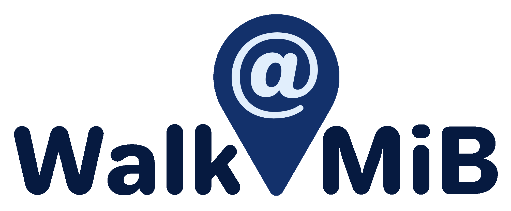

      

# Description
**Walk@mib** is a simple and intuitive android app that helps you navigate within the enclosed spaces of your university campus. If you are ever to get lost while walking from one classroom to another, or finding a vending machine for a snack, **Walk@mib** has got you covered.

## Stack

 

# Functions
## Registration & login

## Explore the map
With **Walk@mib** you can inspect a view of the building layout, enhanced with icons and descriptions of the places or spaces of utility for academic life. 
You can even tailor the app according to your preferences and needs. For example, in case of rain, you can choose to only view indoor pathways, if you have a disability you are suggested a proper path.

## Navigate
Once you've selected the location you wish to reach, the app guides you through the easiest and shortest path that leads to your destination. There's no way you can go wrong!

## Team
- Alex Calabrese: [GitHub](https://github.com/alexcalabrese) | [LinkedIn](https://www.linkedin.com/in/alex-calabrese)
- Christian Ferrareis: [GitHub](https://github.com/FerraChris01) | [LinkedIn](https://www.linkedin.com/in/christian-ferrareis/)
- Andrea Mauriello: [GitHub](https://github.com/sasmau69) | [LinkedIn](https://www.linkedin.com/in/andrea-mauriello)
- Chiara Pagliaroli: [GitHub](https://github.com/https://github.com/Blue3141) | [LinkedIn](https://www.linkedin.com/in/?)
