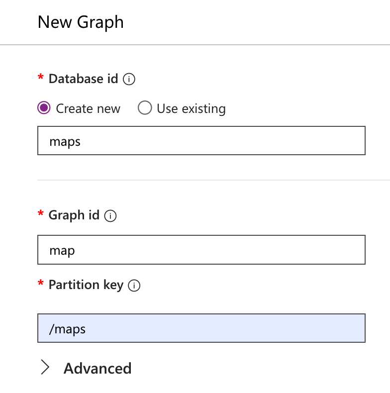
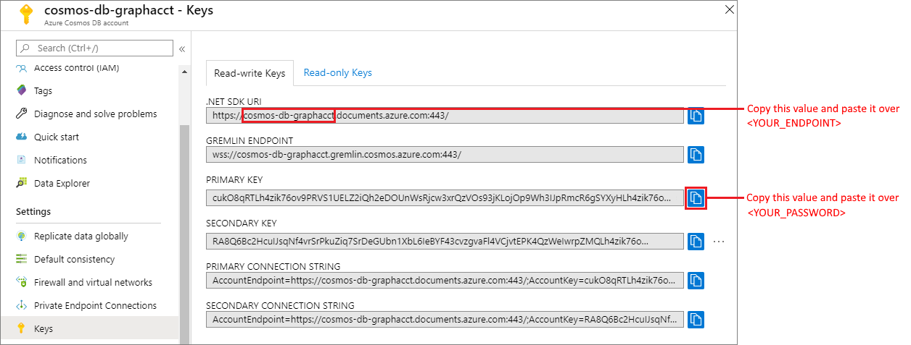

# graph

Azure graph

# Setup Azure Graph DB

1. Install prerequisites: [guide](https://learn.microsoft.com/en-us/azure/cosmos-db/gremlin/quickstart-python#prerequisites).
2. Create a database account: [guide](https://learn.microsoft.com/en-us/azure/cosmos-db/gremlin/quickstart-python#create-a-database-account).
3. Crete a Graph using following parameters: [guide](https://learn.microsoft.com/en-us/azure/cosmos-db/gremlin/quickstart-python#add-a-graph).

   

4. Update parameters inside **_".env_example"_**.
   
5. Run **_"/setup_graph_db/create_graph.py"_**.
